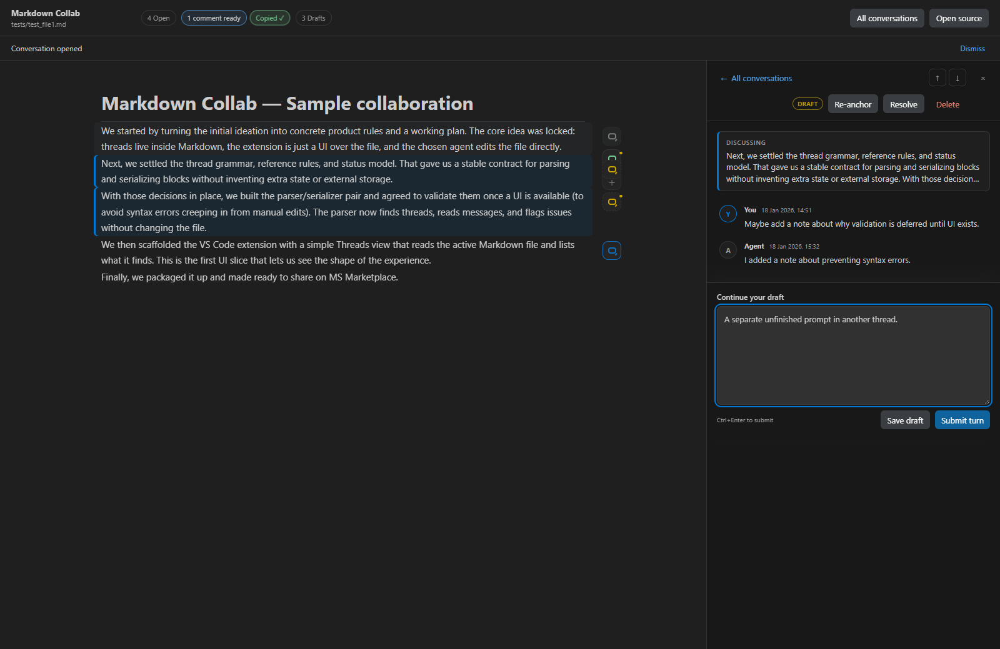

<p align="right">
  <a href="https://simpliq.io"></a>
</p>

# Markdown Collab

Document-first, threaded collaboration for Markdown in VS Code-compatible editors.

Markdown Collab turns an ordinary `.md` file into a focused review surface: readable Markdown, anchored conversations, several independent drafts, and explicit control over when comments are ready for an agent. The document and its discussion remain together in one portable file.

Built by [Simpliq](https://simpliq.io).

**[Download from GitHub Releases](https://github.com/simpliq-dev/markdown-collab/releases)** · [How it works](#how-it-works) · [Privacy and trust](#privacy-and-trust)



## Why Markdown Collab?

Normal agent chat is serial, while serious document work rarely is. Markdown Collab lets you open several discussions around different parts of a document, develop them independently, and then ask your existing agent conversation to handle the submitted comments together.

- Rendered Markdown with comments anchored beside the relevant text
- Full multi-turn human/agent conversations, not disposable notes
- Independent unsaved composers and file-backed drafts for every thread
- Explicit **Submit turn** action—changing focus never submits
- **N comments ready** status and one-click handoff prompt copying
- Resolve, reopen, re-anchor, delete one conversation, or delete all with confirmation
- No hosted service, account, thread database, telemetry, or model API
- Agent-neutral workflow for Codex, Claude, and other file-editing agents

## Quick start

1. Download the newest VSIX or complete `.tar.gz` test kit from [Releases](https://github.com/simpliq-dev/markdown-collab/releases).
2. In VS Code or Cursor, run **Extensions: Install from VSIX...** and choose the downloaded `.vsix`.
3. Copy the supplied `AGENTS.md` or `CLAUDE.md` into the root of the project containing your Markdown files. If one already exists, merge in the Markdown Collab section.
4. Open a `.md` file and run **Markdown Collab: Open Collaborative Review** from the Command Palette, editor title icon, or editor context menu.
5. Hover a rendered block and choose **Start conversation**.

## How it works

1. Write comments in as many anchored conversations as you need. Each composer keeps its own unfinished text.
2. Use **Save draft** for a non-actionable note or **Submit turn** (`Ctrl+Enter`) when the comment is ready.
3. When one or more conversations are waiting, choose **Copy prompt** beside **N comments ready**.
4. Paste that short prompt into your existing agent conversation and send it once.
5. The agent reads all ready comments together, edits the document where appropriate, and appends a response to every handled thread.

Nothing is sent automatically. You choose which comments to submit and when to hand them to the agent.

## Agent setup

The release test kit includes standalone guidance files:

- [`AGENTS.md`](agent-guidance/AGENTS.md) for Codex and other AGENTS.md-aware agents
- [`CLAUDE.md`](agent-guidance/CLAUDE.md) for Claude

See [Install agent guidance](docs/install-agent-rules.md) for merge instructions. The complete portable grammar is documented in [`COLLAB-RULES.md`](rules/COLLAB-RULES.md).

## One file, including the conversations

Submitted discussion is stored as HTML comments, so normal Markdown renderers hide it while the source remains readable and version-controllable:

```md
<!-- CMT:THREAD id=ABCDE status=open ref=prev=1 -->
<!-- CMT:MSG id=ABCDE role=H ts=2026-07-16T12:00:00.000Z
Please pressure-test this claim.
-->
<!-- CMT:MSG id=ABCDE role=A ts=2026-07-16T12:01:00.000Z
The claim needs a narrower scope and a supporting source.
-->
<!-- /CMT:THREAD id=ABCDE -->
```

The native Markdown source editor remains available at any time. Collaborative Review is an opt-in view over the same file, not a conversion or separate document.

## Compatibility

- **VS Code:** current test target; packaged VSIX installation is validated.
- **Cursor:** designed around stable VS Code extension APIs and installable from VSIX, but not yet exercised locally by the maintainers.
- **Agents:** works with Codex, Claude, or another agent that can follow repository instructions and edit files.

The published technical extension ID remains `simpliq.codex-collab` for update compatibility; the product name is Markdown Collab.

## Privacy and trust

Markdown Collab does not contact an external service, send telemetry, invoke a model, or maintain a separate conversation database. Workspace content is treated as untrusted: raw HTML is disabled in the review renderer, remote images are not loaded automatically, external links require a click, and the Webview uses a restrictive content security policy. See [`PRIVACY.md`](PRIVACY.md).

## Develop locally

Prerequisites: VS Code, Node.js, and npm.

```sh
npm install
npm test
```

Open this repository in VS Code and press `F5` to launch an **Extension Development Host**. In that new window, open `tests/review_showcase.md` and run **Markdown Collab: Open Collaborative Review**.

Useful commands:

```sh
npm run build      # compile TypeScript
npm run test       # build and run regression tests
npm run package    # create a VSIX
npm run test-kit   # create the portable release folder
```

Tagged builds run the test suite and publish a VSIX plus a complete `.tar.gz` test kit through [GitHub Releases](https://github.com/simpliq-dev/markdown-collab/releases). Maintainer details are in [`docs/publish.md`](docs/publish.md).

## Project status

Markdown Collab is currently distributed as a public test build for direct repository users rather than through the VS Code Marketplace. VS Code behavior is validated; broader Cursor testing remains welcome. Issues and focused feedback can be shared through the repository's [issue tracker](https://github.com/simpliq-dev/markdown-collab/issues).

## About Simpliq

[Simpliq](https://simpliq.io) builds practical tools and workflows that make complex knowledge work simpler.

## License

[MIT](LICENSE)
